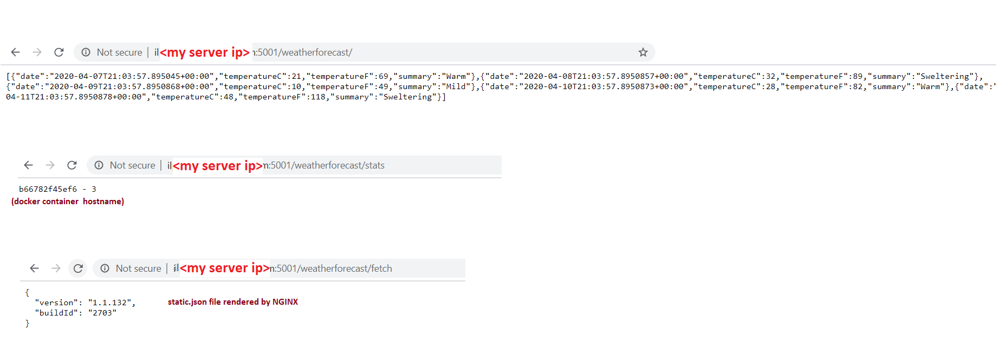

# .NET Core - Demo Web Application
This is a simple .NET Core web app  for weather report.
webserver serves weather  details stats and a nginx file server serves static json file.


# Running Locally using docker-compose
```
$docker-compose -f docker-compose.yml up -d --build

Successfully built 15a065ee26fc
Successfully tagged weather-demoapp:latest
Starting weather-demo_nginx-service_1 ... done
Creating weather-demo_webapp_1        ... done
```

# Check docker-compose services status 
```
$ docker-compose -f docker-compose.yml ps
         Name                        Command               State           Ports
-----------------------------------------------------------------------------------------
testapi_nginx-service_1   nginx -g daemon off;             Up      0.0.0.0:8000->80/tcp
testapi_webapp_1          ./TestApi /bin/bash -c doc ...   Up      0.0.0.0:5001->5001/tcp
```

#  Testing webapp 




# Bring down docker-compose  services
```
[kube@eaasrt TestApi]$ docker-compose -f docker-compose.yml down
Stopping testapi_webapp_1        ... done
Stopping testapi_nginx-service_1 ... done
Removing testapi_webapp_1        ... done
Removing testapi_nginx-service_1 ... done
Removing network testapi_default
```
Web app will listen on the usual Kestrel port of 5001, but this can be changed by setting the `ASPNETCORE_URLS` ENV parameter  in Dockefile.


# Docker images  github and AzureCR

Public Docker image is [available on Dockerhub](https://hub.docker.com/repository/docker/nsvijay04b1/weather-demoapp/).  

Public Docker image is [available on AzureCR]( nsvijaykumar.azurecr.io/apps/weather-demoapp:latest). 


# Running  application on  kubernetes

kubernetes manifest files in `kubernetes/manifests`  folder

```
.
├── deploy-nginx.yaml
├── deploy-webapp.yaml
├── ingress.yaml
├── namespace-webapp.yaml
├── nginx-conf-configmap.yaml
├── nginx-static-file.yaml
├── service-nginx.yaml
└── service-webapp.yaml

```

* First create separate namespace called `weather`
```
kubectl create -f ./namespace-webapp.yaml
namespace/weather created
```

* Create configmaps for nignx  
1. for nginx config
2. static files to be served by nginx as file server

```
kubectl -n weather create -f  ./nginx-conf-configmap.yaml
configmap/nginx-cm created


kubectl -n weather create -f  ./nginx-static-file.yaml
configmap/nginx-static created
```

* Create webapp ( with 2 replicas ) and nginx deployments 
```
kubectl -n weather create -f  ./deploy-webapp.yaml
deployment.apps/weather-webapp created


kubectl -n weather create -f  ./deploy-nginx.yaml
deployment.apps/weather-nginx created
```

*  Create services for webapp and nginx deployments
```
kubectl -n weather create -f  ./service-nginx.yaml
service/nginx-service created

kubectl -n weather create -f  ./service-webapp.yaml
service/weather-webapp-service created
```

* Create ingress to access the webapp service from outside of the cluster
```
kubectl -n weather create -f ./ingress.yaml
ingress.networking.k8s.io/weather-webapp-ingress created
```

* From browser, access using host given in ingress

* http://weather.xxxx.k8s.cloudnative.corp.company.com/weatherforecast
```
[{"date":"2020-04-07T23:21:42.9149386+00:00","temperatureC":19,"temperatureF":66,"summary":"Hot"},
{"date":"2020-04-08T23:21:42.9149778+00:00","temperatureC":-18,"temperatureF":0,"summary":"Balmy"},
{"date":"2020-04-09T23:21:42.9149789+00:00","temperatureC":50,"temperatureF":121,"summary":"Freezing"},
{"date":"2020-04-10T23:21:42.9149794+00:00","temperatureC":-16,"temperatureF":4,"summary":"Cool"},
{"date":"2020-04-11T23:21:42.9149798+00:00","temperatureC":-9,"temperatureF":16,"summary":"Scorching"}]

```

* http://weather.xxxx.k8s.cloudnative.corp.company.com/weatherforecast/stats
```
weather-webapp-7d9cfb4779-v9f84 - 0

```
* http://weather.xxx.k8s.cloudnative.corp.amdocs.com/weatherforecast/fetch
```
{
  "version": "1.1.132",
  "buildId": "2703"
}
```

# GitHub Actions CI/CD 

* A working CI and release GitHub Actions workflow is provided `.github/workflows/build-ci-build-test.yaml`.
 Automated builds are run in GitHub hosted runners
 
 - docker image is built.
 - docker-compose servies created and tested
   docker image is tagged and pushed to repositories.

### [CI using GitHub Actions](https://github.com/nsvijay04b1/weather-demo/actions)

  


* A working CD and release GitHub Actions workflow is provided `.github/workflows/build-cd-deploy-minikube.yaml`.
automated builds are run in GitHub hosted runners

- minikube cluster is created
- namespace is created
- k8s resources deployment, service, configmap, ingress are created


### [CD using GitHub Actions](https://github.com/nsvijay04b1/weather-demo/actions)

  

